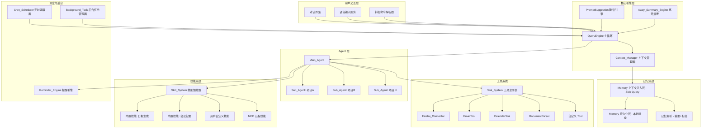
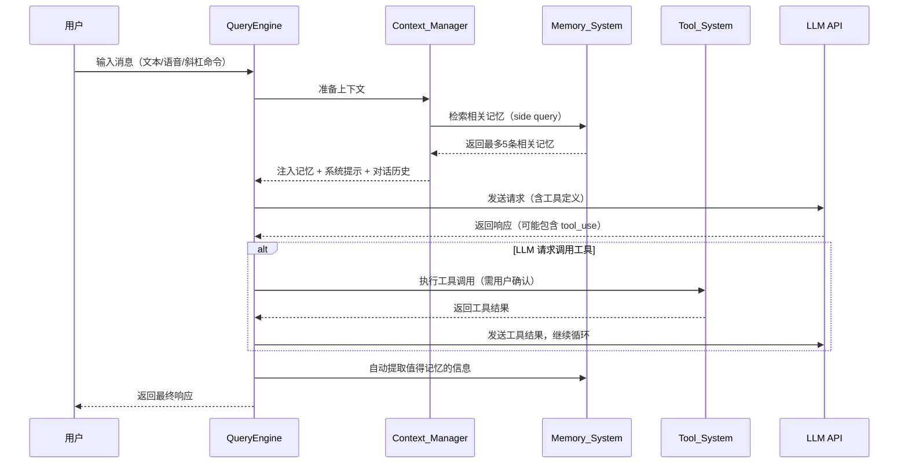

# 技术设计文档：Office Agent（办公智能助理）

## 概述

Office Agent 是一个面向办公场景的 AI Agent 系统，参考 Claude Code 的架构模式进行设计。系统以 QueryEngine 为核心主循环，通过可插拔的 Tool System 提供外部系统对接能力，通过分层 Memory System 实现持久化记忆与上下文注入，通过 Skill System 提供可扩展的预设行为模式，通过 Sub-Agent 机制实现项目级上下文隔离。

核心设计理念：
- 参考 Claude Code 的 QueryEngine 主循环模式，将 LLM 调用、工具执行、上下文管理统一在一个异步生成器循环中
- 参考 Claude Code 的 Tool 抽象（每个 Tool 独立目录、统一接口、权限检查），将办公场景的外部系统对接能力模块化
- 参考 Claude Code 的 memdir 分层记忆架构（持久化层 + LLM side query 相关性检索），实现办公信息的长期记忆
- 参考 Claude Code 的 Skill 系统（SKILL.md + YAML frontmatter + inline/fork 执行模式），实现办公技能的可扩展定义
- 参考 Claude Code 的 Task 系统（多种 TaskType + 状态机），实现后台任务和子 Agent 管理
- 参考 Claude Code 的 CronScheduler（durable 持久化 + 补执行），实现定时调度
- 参考 Claude Code 的 awaySummary / PromptSuggestion / voice 服务，实现离开摘要、主动建议、语音输入

技术栈：TypeScript + Node.js，本地运行，数据存储在用户本地磁盘。

## 架构

### 整体架构图



### 核心架构模式映射

| Claude Code 组件 | Office Agent 对应组件 | 场景适配说明 |
|---|---|---|
| QueryEngine (主循环) | QueryEngine | 从代码编辑循环改为办公对话循环 |
| Tool (可插拔工具) | Tool_System | 从文件读写/Bash 改为飞书/邮件/日历 |
| memdir (分层记忆) | Memory_System | 从代码上下文改为办公信息记忆 |
| Skills (SKILL.md) | Skill_System | 从代码技能改为办公技能（日报、周报等） |
| AgentTool (子 Agent) | Sub_Agent | 从代码子任务改为项目级子 Agent |
| Task (后台任务) | Background_Task | 从代码构建改为文档同步/报告生成 |
| CronScheduler | Cron_Scheduler | 从代码定时任务改为办公定时提醒 |
| awaySummary | Away_Summary_Engine | 从代码进度摘要改为办公事项摘要 |
| PromptSuggestion | 主动建议引擎 | 从代码建议改为办公行动建议 |
| voice service | 语音输入服务 | 保持一致，语音转文本 |
| auto-compact | Context_Manager | 保持一致，上下文压缩 |
| extractMemories | 自动记忆提取 | 从代码记忆改为办公记忆提取 |

### 数据流




## 组件与接口

### 1. QueryEngine（主循环引擎）

参考 Claude Code 的 `QueryEngine` 类，Office Agent 的 QueryEngine 是整个系统的核心调度器。它是一个异步生成器（`async function*`），负责：
- 接收用户输入（文本、语音转文本、斜杠命令）
- 组装上下文（系统提示 + 记忆注入 + 对话历史 + 工具定义）
- 调用 LLM API 并处理流式响应
- 当 LLM 返回 `tool_use` 时，执行工具调用并将结果反馈给 LLM
- 在每轮对话结束后触发自动记忆提取、建议生成等后处理

```typescript
interface QueryEngineConfig {
  model: string;
  systemPrompt: string;
  tools: Tool[];
  memorySystem: MemorySystem;
  contextManager: ContextManager;
  maxTokens: number;
}

class QueryEngine {
  constructor(config: QueryEngineConfig);
  async *submitMessage(userMessage: string, signal: AbortSignal): AsyncGenerator<StreamEvent>;
  interrupt(): void;
  getMessages(): readonly Message[];
  getSessionId(): string;
}
```

**设计决策**：采用异步生成器模式（`async function*`）而非回调模式，因为它天然支持流式输出、可中断、可组合，与 Claude Code 的 `ask()` 函数模式一致。

### 2. Tool_System（工具系统）

参考 Claude Code 的 `Tool` 接口，每个工具是一个独立模块，包含输入 schema 验证、权限检查、执行逻辑、UI 渲染。

```typescript
interface Tool<Input = unknown, Output = unknown> {
  name: string;
  description: string;
  inputSchema: ZodSchema<Input>;
  
  // 权限与状态
  isEnabled(): boolean;
  isReadOnly(input: Input): boolean;
  checkPermissions(input: Input): PermissionResult;
  
  // 核心执行
  call(input: Input, context: ToolContext): Promise<ToolResult<Output>>;
  
  // 用户确认（参考 Claude Code 的权限模型）
  requiresUserConfirmation?(input: Input): boolean;
  prompt?(options: { input: Input }): string;
}

interface ToolContext {
  abortSignal: AbortSignal;
  memorySystem: MemorySystem;
  userConfig: UserConfig;
}

interface ToolResult<T> {
  success: boolean;
  output: T;
  error?: string;
}
```

**预置工具模块**（每个工具独立目录，参考 Claude Code 的 `src/tools/` 结构）：

| 工具名 | 目录 | 职责 | 对应需求 |
|---|---|---|---|
| FeishuConnector | `tools/FeishuConnector/` | 飞书消息发送、日程创建、文档监控、事件订阅 | 需求 2, 9 |
| EmailTool | `tools/EmailTool/` | 邮件发送 | 需求 9 |
| CalendarTool | `tools/CalendarTool/` | 日程创建与查询 | 需求 9 |
| DocumentParser | `tools/DocumentParser/` | 解析飞书云文档、Excel、Word、网页 | 需求 1 |
| TaskManager | `tools/TaskManager/` | 任务 CRUD、状态追踪、筛选查询 | 需求 4 |
| ReminderTool | `tools/ReminderTool/` | 创建/修改/删除提醒 | 需求 5, 6, 7 |
| MemoryTool | `tools/MemoryTool/` | 记忆的手动增删查改 | 需求 3, 13 |
| SubAgentTool | `tools/SubAgentTool/` | 创建/委派/注销子 Agent | 需求 8 |
| CronTool | `tools/CronTool/` | 创建/查看/修改/删除定时任务 | 需求 17 |
| BackgroundTaskTool | `tools/BackgroundTaskTool/` | 派发/查看/取消后台任务 | 需求 18 |

**设计决策**：工具的 `requiresUserConfirmation` 方法控制是否需要用户确认后才执行（如发送消息、创建日程等写操作），读操作默认不需要确认。这参考了 Claude Code 的权限模型，确保用户对敏感操作有控制权。

### 3. Memory_System（记忆系统）

参考 Claude Code 的 `memdir` 模块，采用分层存储架构：

**持久化层**：所有记忆以 Markdown + YAML frontmatter 格式存储在本地磁盘的 `memdir/` 目录下。参考 Claude Code 的 `memoryScan.ts`，每个记忆文件包含 frontmatter 元数据（标题、标签、来源、时间戳、访问频率）和正文内容。

**上下文注入层**：参考 Claude Code 的 `findRelevantMemories.ts`，使用轻量级 LLM side query 从全量记忆中选出最相关的条目注入当前对话上下文。

```typescript
interface MemoryEntry {
  id: string;
  title: string;
  content: string;
  type: MemoryType;
  tags: string[];
  source: MemorySource;
  projectId?: string;
  createdAt: Date;
  updatedAt: Date;
  accessCount: number;
  lastAccessedAt: Date;
}

type MemoryType = 'preference' | 'task' | 'project_context' | 'colleague' | 'conversation_summary' | 'decision' | 'commitment';
type MemorySource = 'user_input' | 'feishu_doc' | 'feishu_message' | 'auto_extract' | 'document_upload';

interface MemorySystem {
  // 持久化层操作
  store(entry: Omit<MemoryEntry, 'id' | 'createdAt' | 'accessCount' | 'lastAccessedAt'>): Promise<MemoryEntry>;
  update(id: string, updates: Partial<MemoryEntry>): Promise<MemoryEntry>;
  delete(id: string): Promise<void>;
  deleteAll(): Promise<void>;
  
  // 检索
  search(query: MemoryQuery): Promise<MemoryEntry[]>;
  
  // 上下文注入层（参考 findRelevantMemories）
  findRelevantMemories(conversationContext: string, signal: AbortSignal): Promise<MemoryEntry[]>;
  
  // 自动提取（参考 extractMemories）
  extractAndStoreFromConversation(messages: Message[]): Promise<void>;
  
  // 导出
  exportAll(format: 'json' | 'markdown'): Promise<string>;
}

interface MemoryQuery {
  projectId?: string;
  type?: MemoryType;
  tags?: string[];
  timeRange?: { start: Date; end: Date };
  keyword?: string;
  limit?: number;
  sortBy?: 'relevance' | 'recency' | 'frequency';
}
```

**记忆文件格式**（参考 Claude Code 的 memdir 文件格式）：

```markdown
---
title: "张三偏好早上开会"
type: preference
tags: [会议, 偏好, 张三]
source: auto_extract
project: q2-planning
created: 2024-01-15T09:30:00Z
updated: 2024-01-15T09:30:00Z
access_count: 3
last_accessed: 2024-01-16T14:00:00Z
---

用户提到张三更喜欢在早上 10 点之前安排会议，下午通常有客户拜访。
```

**相关性检索流程**（参考 `findRelevantMemories.ts`）：
1. 扫描 `memdir/` 目录下所有记忆文件的 frontmatter（标题 + 标签 + 类型）
2. 构建记忆清单（manifest）
3. 使用轻量级 LLM side query，传入当前对话意图 + 记忆清单，让 LLM 选出最多 5 条最相关的记忆
4. 读取选中记忆的完整内容，注入当前对话上下文

**设计决策**：选择 LLM side query 而非向量数据库进行相关性检索，原因是：(1) 参考 Claude Code 的成熟实践，LLM 对语义理解更准确；(2) 避免引入额外的向量数据库依赖，保持系统轻量；(3) 记忆条目数量在办公场景下通常可控（数百到数千条），side query 的延迟可接受。

### 4. Skill_System（技能系统）

参考 Claude Code 的 `skills/` 模块，技能以 Markdown + YAML frontmatter 格式定义，支持三种来源：内置（bundled）、用户自定义、MCP 远程。

```typescript
interface SkillItem {
  name: string;
  description: string;
  whenToUse: string;
  allowedTools: string[];
  executionMode: 'inline' | 'fork';
  source: 'bundled' | 'user' | 'mcp';
  instructions: string;  // Markdown 正文部分
  arguments?: string[];  // 支持 $ARGUMENTS 变量替换
}

interface SkillSystem {
  loadSkills(): Promise<SkillItem[]>;
  findSkill(nameOrTrigger: string): SkillItem | undefined;
  executeSkill(skill: SkillItem, args: string, context: SkillContext): Promise<SkillResult>;
  suggestSkill(conversationContext: string): SkillItem | undefined;
}
```

**技能文件格式**（参考 Claude Code 的 SKILL.md）：

```markdown
---
name: daily-report
description: 生成每日工作汇报
when_to_use: 当用户要求生成日报、工作汇报、今日总结时
allowed_tools: [TaskManager, MemoryTool, FeishuConnector]
execution_mode: inline
---

# 每日工作汇报生成

请按以下步骤生成今日工作汇报：

1. 使用 TaskManager 查询今日已完成的任务
2. 使用 TaskManager 查询今日进行中的任务
3. 使用 MemoryTool 检索今日的重要决策和会议记录
4. 按以下格式生成汇报：
   - 今日完成事项
   - 进行中事项及进展
   - 明日计划
   - 需要协调的事项

如果用户提供了额外要求：$ARGUMENTS
```

**内置技能列表**：
- `daily-report`：每日工作汇报生成
- `meeting-notes`：会议纪要整理
- `task-breakdown`：大任务拆解（fork 模式）
- `feishu-sync`：飞书文档状态同步
- `weekly-report`：周报生成（fork 模式）

**设计决策**：`fork` 模式的技能会创建独立的子 Agent 执行（参考 Claude Code 的 AgentTool），避免长时间执行的技能阻塞主对话。`inline` 模式直接在当前上下文中执行，适合快速完成的技能。

### 5. Sub_Agent（动态子 Agent）

参考 Claude Code 的 `AgentTool`，Sub_Agent 是由 Main_Agent 动态创建的项目级 Agent，拥有独立的上下文和记忆空间。

```typescript
interface SubAgent {
  id: string;
  projectId: string;
  projectName: string;
  status: 'active' | 'archived';
  createdAt: Date;
  memoryDir: string;  // 独立的记忆目录
}

interface SubAgentManager {
  create(projectName: string, initialContext: string): Promise<SubAgent>;
  delegate(agentId: string, message: string): Promise<string>;
  archive(agentId: string): Promise<void>;
  list(): SubAgent[];
  getByProject(projectId: string): SubAgent | undefined;
}
```

**设计决策**：每个 Sub_Agent 拥有独立的 `memdir/` 子目录（参考 Claude Code 的 `agentMemory.ts` 中的 `getAgentMemoryDir`），项目结束后将关键信息归档到 Main_Agent 的记忆系统中再注销。

### 6. Context_Manager（上下文管理器）

参考 Claude Code 的 `compact` 服务和 `tokenBudget` 模块。

```typescript
interface ContextManager {
  // Token 预算分配
  allocateBudget(): TokenBudgetAllocation;
  
  // 自动压缩（参考 auto-compact）
  shouldAutoCompact(currentTokens: number): boolean;
  compact(messages: Message[]): Promise<CompactResult>;
  
  // 上下文组装
  buildContext(params: {
    systemPrompt: string;
    memories: MemoryEntry[];
    conversationHistory: Message[];
    toolDefinitions: ToolDefinition[];
  }): ContextPayload;
}

interface TokenBudgetAllocation {
  systemPrompt: number;    // 系统提示预算
  memoryInjection: number; // 记忆注入预算
  conversationHistory: number; // 对话历史预算
  toolResults: number;     // 工具结果预算
  total: number;
}

interface CompactResult {
  compressedMessages: Message[];
  extractedMemories: MemoryEntry[];  // 压缩过程中提取的长期记忆
  summary: string;
}
```

**设计决策**：参考 Claude Code 的 `autoCompact.ts`，当 token 使用量达到上下文窗口的 90% 时触发自动压缩。压缩过程中会将值得长期保留的信息提取到 Memory_System，避免信息丢失。

### 7. Reminder_Engine（提醒引擎）

提醒引擎基于 Cron_Scheduler 实现，负责三类提醒：定时提醒、截止日期提醒、智能判断提醒。

```typescript
interface ReminderEngine {
  // 定时提醒
  scheduleDailyBriefing(time: string): void;
  scheduleWeeklySummary(dayOfWeek: number, time: string): void;
  
  // 截止日期提醒
  checkDeadlines(): Promise<Reminder[]>;
  
  // 智能提醒
  analyzeForSmartReminders(messages: Message[], tasks: TaskItem[]): Promise<Reminder[]>;
  
  // 管理
  cancelReminder(taskId: string): void;
  setReminderIntensity(level: 'low' | 'standard' | 'high'): void;
}

interface Reminder {
  id: string;
  type: 'daily_briefing' | 'weekly_summary' | 'deadline_urgent' | 'deadline_warning' | 'smart_followup' | 'smart_commitment' | 'smart_stale_project';
  taskId?: string;
  message: string;
  reason: string;  // 提醒原因说明
  scheduledAt: Date;
  delivered: boolean;
}
```

### 8. Cron_Scheduler（定时调度器）

参考 Claude Code 的 `cronScheduler.ts` 和 `ScheduleCronTool`。

```typescript
interface CronTask {
  id: string;
  type: 'one_time' | 'recurring';
  cronExpression?: string;  // 循环任务使用 cron 表达式
  scheduledAt?: Date;       // 一次性任务使用具体时间
  prompt: string;           // 触发时注入 Main_Agent 的 prompt
  description: string;
  timezone: string;
  durable: boolean;         // 是否持久化到磁盘
  lastRunAt?: Date;
  createdAt: Date;
}

interface CronScheduler {
  create(task: Omit<CronTask, 'id' | 'createdAt'>): Promise<CronTask>;
  update(id: string, updates: Partial<CronTask>): Promise<CronTask>;
  delete(id: string): Promise<void>;
  list(): CronTask[];
  
  // 启动调度循环
  start(): void;
  stop(): void;
  
  // 补执行错过的任务（参考 Claude Code 的 missed task 机制）
  checkMissedTasks(): Promise<CronTask[]>;
}
```

**设计决策**：参考 Claude Code 的 durable cron 模式，定时任务持久化到磁盘的 JSON 文件中，系统重启后自动恢复。一次性任务执行后自动删除，循环任务按 cron 表达式重复执行。

### 9. Away_Summary_Engine（离开摘要引擎）

参考 Claude Code 的 `awaySummary.ts`。

```typescript
interface AwaySummaryEngine {
  // 检测用户是否离开
  checkUserActivity(): UserActivityStatus;
  
  // 生成摘要
  generateSummary(messages: Message[], signal: AbortSignal): Promise<string | null>;
  
  // 配置
  setThreshold(minutes: number): void;
  getThreshold(): number;
}

interface UserActivityStatus {
  isAway: boolean;
  awayDurationMinutes: number;
  lastActivityAt: Date;
}
```

**设计决策**：参考 Claude Code 的实现，摘要生成使用轻量级 LLM 调用（小模型），仅取最近 30 条消息作为上下文，避免 prompt 过长。如果离开期间没有新事件，不生成摘要。

### 10. Background_Task（后台任务管理器）

参考 Claude Code 的 `Task.ts` 和 `tasks/` 目录。

```typescript
type BackgroundTaskType = 'document_sync' | 'report_generation' | 'feishu_batch_sync' | 'data_export' | 'sub_agent';
type BackgroundTaskStatus = 'pending' | 'running' | 'completed' | 'failed' | 'cancelled';

interface BackgroundTaskState {
  id: string;
  type: BackgroundTaskType;
  status: BackgroundTaskStatus;
  description: string;
  startTime: number;
  endTime?: number;
  result?: string;
  error?: string;
}

interface BackgroundTaskManager {
  spawn(type: BackgroundTaskType, description: string, execute: () => Promise<string>): Promise<string>;
  cancel(taskId: string): Promise<void>;
  getStatus(taskId: string): BackgroundTaskState | undefined;
  list(): BackgroundTaskState[];
  onComplete(taskId: string, callback: (result: BackgroundTaskState) => void): void;
}
```

### 11. Voice Service（语音输入服务）

参考 Claude Code 的 `voice.ts` 和 `voiceStreamSTT.ts`。

```typescript
interface VoiceService {
  // 录音控制
  startRecording(signal: AbortSignal): Promise<void>;
  stopRecording(): AudioBuffer;
  
  // 语音转文本
  transcribe(audio: AudioBuffer): Promise<TranscriptionResult>;
  
  // 流式识别
  startStreamTranscription(onPartial: (text: string) => void): void;
  
  // 状态
  isRecording(): boolean;
  checkAvailability(): Promise<VoiceAvailability>;
}

interface TranscriptionResult {
  text: string;
  confidence: number;
  needsConfirmation: boolean;  // 置信度低时需要用户确认
}
```

### 12. PromptSuggestion（主动建议引擎）

参考 Claude Code 的 `PromptSuggestion/promptSuggestion.ts`。

```typescript
interface PromptSuggestionEngine {
  generateSuggestions(context: SuggestionContext): Promise<Suggestion[]>;
  dismissSuggestion(suggestionId: string): void;
  getDismissedSuggestions(): string[];  // 避免重复建议
}

interface SuggestionContext {
  currentTasks: TaskItem[];
  recentMessages: Message[];
  upcomingDeadlines: TaskItem[];
  userActivityPattern: ActivityPattern;
}

interface Suggestion {
  id: string;
  text: string;
  reason: string;
  priority: 'high' | 'medium' | 'low';
}
```

### 13. Feishu_Connector（飞书连接器）

飞书连接器是 Tool_System 中最复杂的工具模块，负责与飞书开放平台 API 对接。

```typescript
interface FeishuConnector extends Tool {
  // 消息
  sendMessage(chatId: string, content: string): Promise<void>;
  watchMessages(config: FeishuWatchConfig): void;
  
  // 文档
  watchDocuments(spaceIds: string[]): void;
  getDocumentContent(docId: string): Promise<string>;
  
  // 日程
  createCalendarEvent(event: CalendarEvent): Promise<string>;
  
  // 事件订阅
  startEventSubscription(): void;
  stopEventSubscription(): void;
  
  // 断连恢复
  reconnect(): Promise<void>;
  getDisconnectGap(): { start: Date; end: Date } | null;
}

interface FeishuWatchConfig {
  chatGroups: string[];
  documentSpaces: string[];
  folders: string[];
}
```

### 14. Document_Parser（文档解析器）

```typescript
interface DocumentParser extends Tool {
  parse(input: DocumentInput): Promise<InformationEntry[]>;
  getSupportedFormats(): string[];
  formatOutput(entry: InformationEntry): string;
}

type DocumentInput = 
  | { type: 'feishu_doc'; docId: string }
  | { type: 'excel'; buffer: Buffer; filename: string }
  | { type: 'word'; buffer: Buffer; filename: string }
  | { type: 'webpage'; url: string }
  | { type: 'text'; content: string };
```

## 数据模型

### TaskItem（任务条目）

```typescript
interface TaskItem {
  id: string;
  description: string;
  status: TaskStatus;
  priority: TaskPriority;
  projectId?: string;
  parentTaskId?: string;       // 支持子任务
  subtaskIds: string[];
  dueDate?: Date;
  source: TaskSource;
  reminderAdvance?: number;    // 自定义提醒提前量（分钟）
  createdAt: Date;
  updatedAt: Date;
  completedAt?: Date;
}

type TaskStatus = 'pending' | 'in_progress' | 'completed' | 'overdue' | 'cancelled';
type TaskPriority = 'urgent' | 'high' | 'medium' | 'low';
type TaskSource = 'user_input' | 'feishu_message' | 'feishu_doc' | 'auto_detect';
```

### InformationEntry（信息条目）

```typescript
interface InformationEntry {
  id: string;
  title: string;
  content: string;
  type: InformationType;
  source: InformationSource;
  tags: string[];
  extractedEntities: ExtractedEntity[];
  createdAt: Date;
  updatedAt: Date;
}

type InformationType = 'meeting_note' | 'decision' | 'action_item' | 'reference' | 'contact' | 'general';
type InformationSource = 'user_input' | 'feishu_doc' | 'feishu_message' | 'excel' | 'word' | 'webpage';

interface ExtractedEntity {
  type: 'person' | 'date' | 'task' | 'deadline' | 'commitment';
  value: string;
  confidence: number;
}
```

### UserConfig（用户配置）

```typescript
interface UserConfig {
  // 工作时间
  workingHours: {
    start: string;  // "09:00"
    end: string;    // "18:00"
    workDays: number[];  // [1,2,3,4,5] 周一到周五
  };
  
  // 提醒配置
  reminder: {
    dailyBriefingTime: string;  // "09:00"
    weeklySummaryDay: number;   // 5 = 周五
    weeklySummaryTime: string;  // "17:00"
    intensity: 'low' | 'standard' | 'high';
  };
  
  // 离开摘要
  awaySummary: {
    thresholdMinutes: number;  // 默认 5
  };
  
  // 飞书配置
  feishu: {
    enabled: boolean;
    appId?: string;
    appSecret?: string;  // 加密存储
    watchConfig?: FeishuWatchConfig;
  };
  
  // 工具启用状态
  enabledTools: string[];
  
  // 智能提醒
  smartReminder: {
    staleProjectDays: number;  // 项目多少天无更新触发提醒
  };
  
  timezone: string;
}
```

### 持久化存储结构

```
~/.office-agent/
├── config.json                    # 用户配置（UserConfig）
├── tasks.json                     # 任务数据（TaskItem[]）
├── cron-tasks.json                # 定时任务（CronTask[]）
├── sessions/                      # 会话历史
│   └── {session-id}.json
├── memdir/                        # 记忆系统（Markdown + YAML frontmatter）
│   ├── MEMORY.md                  # 主记忆入口文件
│   ├── preferences/               # 用户偏好
│   ├── projects/                  # 项目上下文
│   ├── colleagues/                # 同事信息
│   ├── decisions/                 # 重要决策
│   └── auto/                      # 自动提取的记忆
├── agents/                        # 子 Agent 记忆
│   └── {project-id}/
│       └── memdir/
├── skills/                        # 用户自定义技能
│   └── *.md
├── tools/                         # 工具配置
│   └── feishu/
│       └── credentials.enc        # 加密的凭证
└── background-tasks/              # 后台任务输出
    └── {task-id}.json
```

### 序列化格式

- **记忆条目**：Markdown + YAML frontmatter（参考 Claude Code memdir 格式）
- **任务数据**：JSON（支持往返一致性序列化/反序列化）
- **系统配置**：JSON
- **会话历史**：JSON
- **定时任务**：JSON（durable 模式持久化）
- **敏感信息**：加密存储（API 密钥、认证令牌使用 AES-256-GCM 加密）

